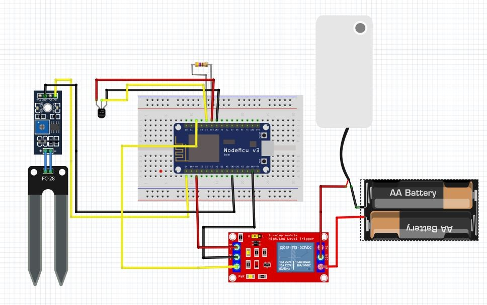
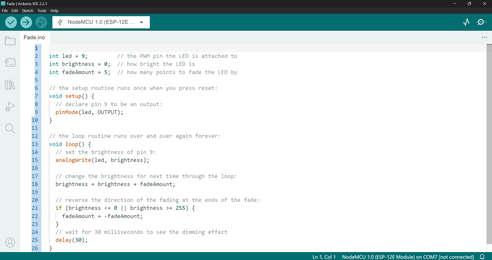
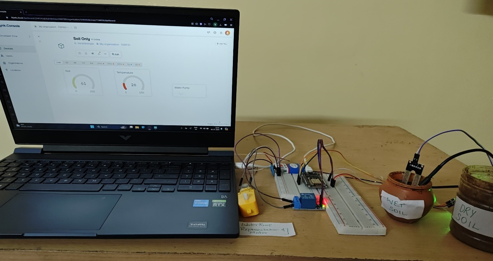
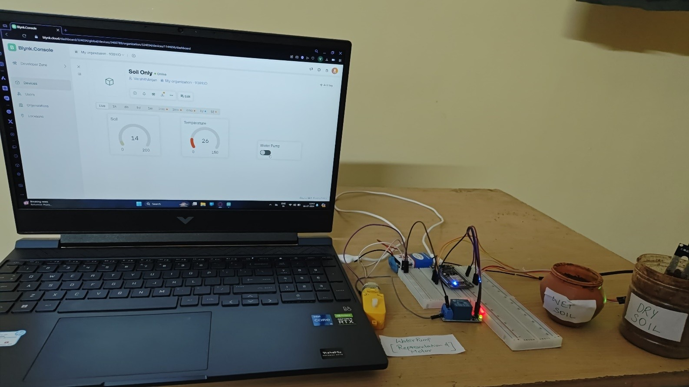
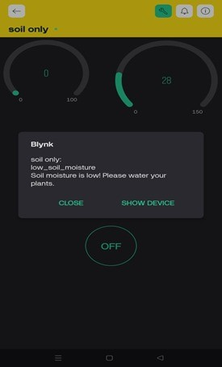

# 🌱 Smart Soil Monitoring System

> An IoT-based smart soil monitoring and automated irrigation system designed for real-time soil condition monitoring and efficient water management.

## 📌 Overview

The Smart Soil Monitoring System is an IoT-based solution that monitors soil moisture and temperature in real time and helps automate irrigation.

The system uses a NodeMCU ESP8266 to collect sensor data, communicate through Wi-Fi, and connect with the Blynk platform for remote monitoring and control.

When soil moisture falls below the configured threshold, the system can activate the water pump through a relay to support automated irrigation.

## 🎯 Problem Statement

Traditional irrigation practices often depend on manual monitoring of soil conditions. This can lead to delayed irrigation decisions and inefficient water usage.

This project aims to provide a low-cost IoT solution for monitoring soil conditions and automating irrigation based on real-time data.

## 💡 Solution

The system combines:

- 🌱 Soil moisture sensing
- 🌡️ Temperature monitoring
- 📡 ESP8266 Wi-Fi connectivity
- ☁️ Blynk IoT platform
- 💧 Relay-controlled water pump
- 🔔 Monitoring and alerts
- 📱 Remote control

## ✨ Key Features

- Real-time soil moisture monitoring
- Real-time temperature monitoring
- Automated irrigation
- Remote monitoring through Blynk
- Water-pump control
- Low-moisture monitoring and alerts
- Wi-Fi-based IoT communication
- Low-cost prototype

## 🛠️ Technologies & Components

### Hardware

- NodeMCU ESP8266
- Soil Moisture Sensor
- DS18B20 Temperature Sensor
- Relay Module
- Water Pump

### Software & Platforms

- Arduino IDE
- C/C++
- Blynk
- Wi-Fi / IoT

## 🔄 System Architecture

```text
┌──────────────────────┐
│   Soil Moisture      │
│       Sensor         │
└──────────┬───────────┘
           │
           ▼
┌──────────────────────┐
│ DS18B20 Temperature  │
│       Sensor         │
└──────────┬───────────┘
           │
           ▼
┌──────────────────────┐
│   NodeMCU ESP8266    │
└──────────┬───────────┘
           │
           │ Wi-Fi
           ▼
┌──────────────────────┐
│     Blynk Cloud      │
└──────────┬───────────┘
           │
       ┌───┴────┐
       ▼        ▼
   Monitoring  Alerts
                │
                ▼
          Relay → Pump

⚙️ How It Works
Sensors collect soil moisture and temperature data.
NodeMCU ESP8266 processes the sensor readings.
The device communicates through Wi-Fi.
Sensor data is sent to the Blynk platform.
Soil conditions can be monitored remotely.
When soil moisture reaches the configured condition, the relay can control the water pump.
The system supports automated irrigation and remote control.
👨‍💻 My Contribution

I contributed across the complete project lifecycle, including:

Problem identification
System design
Hardware assembly
NodeMCU/Arduino programming
Sensor integration
Blynk IoT setup
Irrigation automation
Circuit implementation
Testing and debugging
Documentation
Project presentation
🧪 Testing

The system was tested under different soil conditions to verify sensor readings and irrigation behavior.

Testing included:

Wet-soil measurements
Dry-soil measurements
Sensor data monitoring
Blynk monitoring
Water-pump operation
System integration testing
📊 Results

The prototype demonstrated:

Real-time soil monitoring
Temperature monitoring
IoT-based remote monitoring
Automated irrigation control
Water-pump control
Alert/notification functionality
💰 Prototype Cost

The reported prototype cost was approximately:

₹800

The low-cost design makes the system suitable as an affordable prototype for smart agriculture applications.

🔮 Future Enhancements

Possible future improvements include:

NPK monitoring
Soil pH monitoring
Weather-data integration
Solar-powered operation
Historical data visualization
Larger sensor networks
Machine-learning-based irrigation prediction
Remote diagnostics
👥 Project Type

Academic Group Project

🏫 Institution

Dayananda Sagar Academy of Technology and Management

📚 Documentation

The detailed academic project report is included in this repository.

---

## 📸 Project Gallery

### 🔌 Circuit Setup



The circuit integrates the NodeMCU ESP8266, soil moisture sensor, relay module and supporting components.

### 💻 Arduino IDE / ESP8266 Development



Arduino IDE was used for developing and uploading the ESP8266-based system code.

### 🌱 Wet Soil Testing



Testing the system under wet-soil conditions.

### 🪴 Dry Soil Testing



Testing the system under dry-soil conditions to verify moisture detection and irrigation behavior.

### 📱 Blynk Dashboard & Low-Moisture Alert



The Blynk interface provides remote monitoring and displays a low-soil-moisture notification when the configured threshold is reached.

---

## 💻 Source Code

The Arduino/ESP8266 implementation is available here:

👉 [View Smart Soil Monitoring Code](code/smart-soil-monitoring.ino)

---

## 📚 Project Documentation

The detailed academic project report can be added to this repository under the `docs/` directory.

---

## 🏆 Project Highlights

| Area | Implementation |
|---|---|
| Microcontroller | NodeMCU ESP8266 |
| Programming | Arduino / C++ |
| Soil Monitoring | Soil Moisture Sensor |
| Temperature | DS18B20 |
| IoT Platform | Blynk |
| Communication | Wi-Fi |
| Automation | Relay + Water Pump |
| Alerts | Low Soil Moisture Notification |
| Control | Automatic + Manual |

---

## 👨‍💻 Project Role

**End-to-End Project Development — Team Member**

Contributed across problem identification, system design, hardware assembly, programming, sensor integration, Blynk setup, irrigation automation, testing, debugging, documentation and presentation.

---

⭐ If you find this project interesting, consider giving the repository a star!
